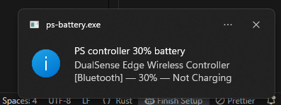
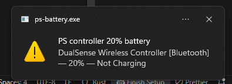
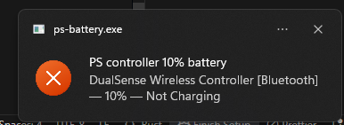
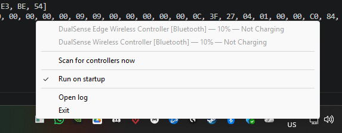

# PS Battery

I was so annoyed by my PlayStation controllers running out of battery without warning when playing on PC. I made this Rust app to give me a heads-up before it's too late.

## Features

1. Alerts you every 5 minutes if you have a low-battery controller connected via Bluetooth that is not charging.
2. If a low-battery controller is detected, alert the user in the following way:
   - Play a system sound:
     - ≤10% => Critical Stop
     - ≤20% => Exclamation
     - ≤30% => Notification
   - Show a Windows notification (while gaming, Windows turns on Focus Mode, so you might miss these).
3. Adds an application to the Windows tray. Right-clicking it shows:
   - All connected controllers, their battery %, and whether they are charging.
   - **Scan for controllers now** — trigger an immediate scan instead of waiting for the next automatic check.
   - **Run on startup** — run the app on Windows login (off by default).
   - **Open log** — open the log file (`%APPDATA%\ps-battery\ps-battery.log`).

## Disclaimer

I am a frontend/backend web developer. I have no prior experience building Windows applications or writing Rust code. Neither do I know anything about the PlayStation controller specifications. This has only been tested using my own controllers on my own Windows installation.

## Any issues?

This has been an awesome weekend project. If you have any issues, feel free to open a GitHub issue or contact me. Otherwise, this code is unlicensed, so do whatever you want with it: https://unlicense.org/
