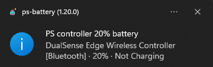
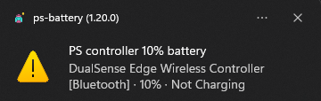
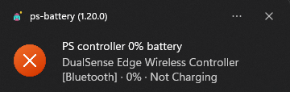
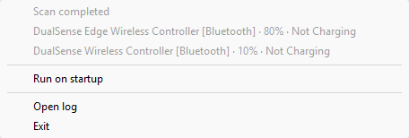

# PS Battery


I was so annoyed by my PlayStation controllers running out of battery without warning when playing on PC. I made this Rust app to give me a heads-up before it's too late.

## Features

1. Alerts you every 5 minutes if you have a low-battery controller connected via Bluetooth that is not charging.
2. If a low-battery controller is detected, alert the user in the following way. Controllers report their charge as a single 0-10 level, so the battery percentage is always a multiple of 10 and these are the only three levels that trigger an alert:
   - Show a Windows notification balloon based on remaining battery:
     - 0% => Error balloon
     - 10% => Warning balloon
     - 20% => Info balloon
   - Play a system sound when in game / fullscreen / presentation mode (to cut through the DND silence):
     - 0% => Critical Stop
     - 10% => Exclamation
     - 20% => Notification
3. Adds an application to the Windows tray. Opening the menu triggers an immediate background scan (instead of waiting for the next automatic check), then shows:
   - A "Scanning for controllers…" / "Scan completed" line while the scan is running and just after it finishes.
   - All connected controllers, their battery %, and whether they are charging.
   - **Run on startup**: run the app on Windows login (off by default).
   - **Open log**: open the log file (`%APPDATA%\ps-battery\ps-battery.log`).









## Microsoft Store packaging

The app is also packaged as an MSIX so it can be submitted to the Microsoft Store, where Microsoft signs the package and users don't get the "Unknown publisher" warning that the direct `.exe` download shows. The direct `.exe` download stays available either way.

Every release builds the MSIX and uploads it as a **workflow artifact** rather than a release asset, because it is signed with a throwaway self-signed certificate that end users do not trust. The Store re-signs it on submission.

Requires the [winapp CLI](https://github.com/microsoft/winappCli) (`winget install microsoft.winappcli`):

```
cargo build --release                                  # build the exe
mkdir dist && copy target\release\ps-battery.exe dist\  # stage the layout
winapp pack ./dist --manifest Package.appxmanifest --generate-cert
```

To run locally with real package identity (requires Windows Developer Mode; no signing needed):

```
winapp run .\target\release
```

Before an actual Store submission, the placeholder `Publisher` CN in `Package.appxmanifest` still needs replacing with the real one Partner Center issues once the app name is reserved.

`Assets/icon.svg` is the source of truth for the app icon; `Assets/*.png` and `Assets/app.ico` are generated from it and shouldn't be hand-edited. Regenerate them after changing the SVG with:

```
rsvg-convert -w 1024 -h 1024 Assets/icon.svg -o icon_source.png
winapp manifest update-assets icon_source.png
```

## Privacy

PS Battery collects nothing and sends nothing, because it has no network access at all. It does write a local diagnostic log you can read or delete yourself. See [PRIVACY.md](PRIVACY.md).

## Disclaimer

I am a frontend/backend web developer. I have no prior experience building Windows applications or writing Rust code. Neither do I know anything about the PlayStation controller specifications. This has only been tested using my own controllers on my own Windows installation.

## Any issues?

This has been an awesome weekend project. If you have any issues, feel free to open a GitHub issue or contact me. Otherwise, this code is unlicensed, so do whatever you want with it: https://unlicense.org/
