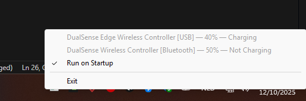

# PS Battery

I was so annoyed by my PlayStation controllers running out of battery without warning when playing on PC. I made this Rust app to give me a heads-up before it's too late.

## Features
1. Every 5 minutes, checks if you have a low-battery controller connected that is not charging.
2. If a low-battery controller is detected, alert the user in the following way:
    - Play a sound:
        - 30% => Windows Notify System Generic.wav
        - 20% => Windows Exclamation.wav
        - 10% => Windows Critical Stop.wav
    - Get a Windows notification (while gaming, Windows turns on Focus Mode, so you might miss these).
3. Adds an application to the Windows tray. If you right-click this, you can see all connected controllers, their battery %, and whether they are charging or not.
4. Via the tray, provides the option to run this application on startup (Windows login), so you will never get surprised again by a controller running out of battery. This is off by default.

## Disclaimer
I am a frontend/backend web developer. I have no prior experience building Windows applications or writing Rust code. Neither do I know anything about the PlayStation controller specifications. This has only been tested using my own controllers on my own Windows installation.

## Any issues?
This has been an awesome weekend project. If you have any issues, feel free to open a GitHub issue or contact me. Otherwise, this code is unlicensed, so do whatever you want with it: https://unlicense.org/
